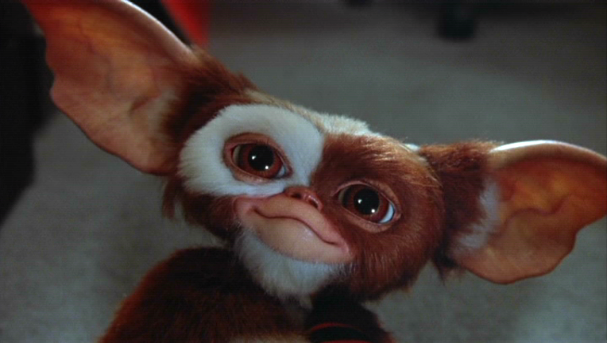

## gremlin

No in the development plans

<!--  C1 if I remember correctly Wolak never develop his package to do Multivariate mixed model  -->

Meanwhile

```{r, echo=FALSE, out.width="100%", fig.cap="Keep it dry and do no feed after midnight."}

```
